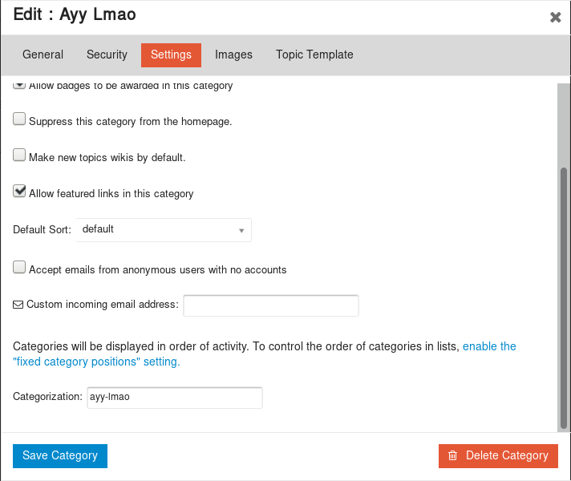

# category-categorization
*Discourse plugin which enables categorization of categories*

## Bug reports

Bug reports should be filed [by following the process described here](https://discourse.mozilla.org/t/where-do-i-file-bug-reports-about-discourse/32078).

## Installation

Follow the Discourse [Install a Plugin](https://meta.discourse.org/t/install-a-plugin/19157) guide.

## Usage

A categorization can be defined in the category settings modal:

It'll then appear in `/categories.json` and `/c/:id/show.json` as the `categorization` property.

## Licence

[MPL 2.0](https://www.mozilla.org/MPL/2.0/)
